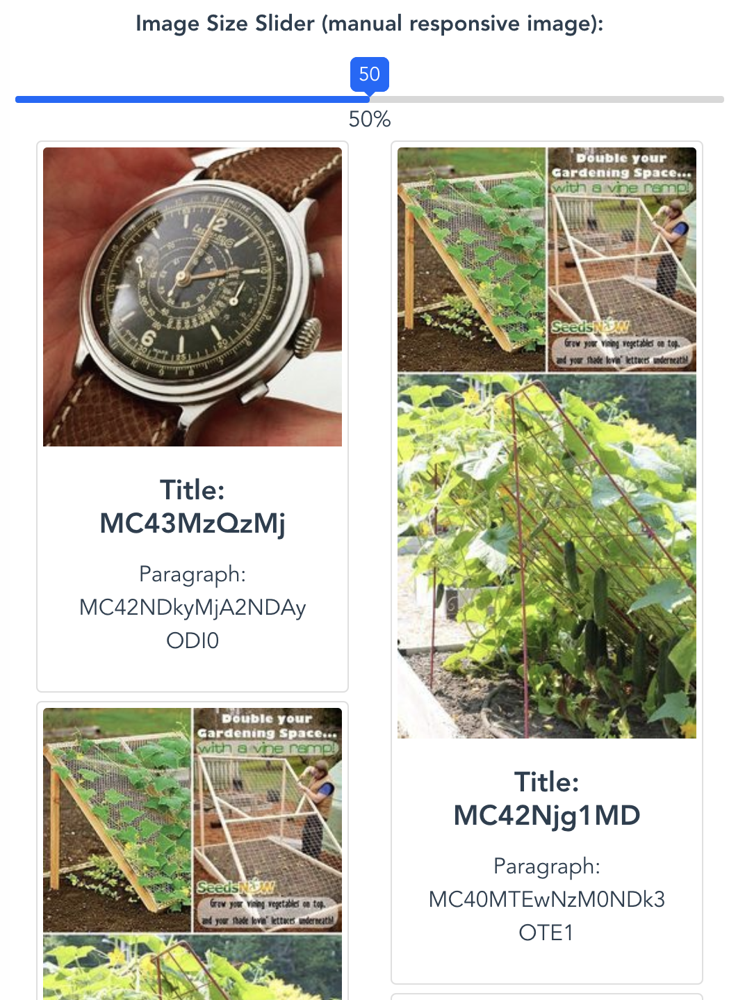
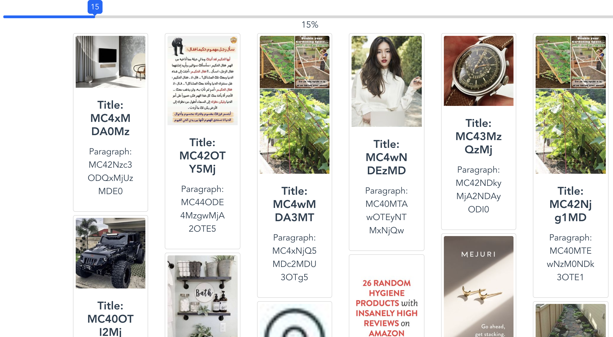

# Vue Pinterest demo 

Vue front end for infinite scroll Pinterest site.

### Vue shortcut
```
yarn install
yarn run serve
yarn run build
yarn run test
yarn run lint
```

### Customize configuration
See [Configuration Reference](https://cli.vuejs.org/config/).

### Previewing Locally

    * Making sure flask backend runs on port 5000, or modify Masonary.vue for js remote call.

    * Serve built files locally
        
        npm install -g serve

        serve -s dist -l 8080

### Version

    yarn 1.19.0

    node v10.15.3

    mac Mojave

### Library

[bootstrap-vue 2.0.2](https://bootstrap-vue.js.org/docs/components/alert)

"vue-masonry": "^0.11.8"

"vue-slide-bar": "^1.2.0

### Snapshot:





